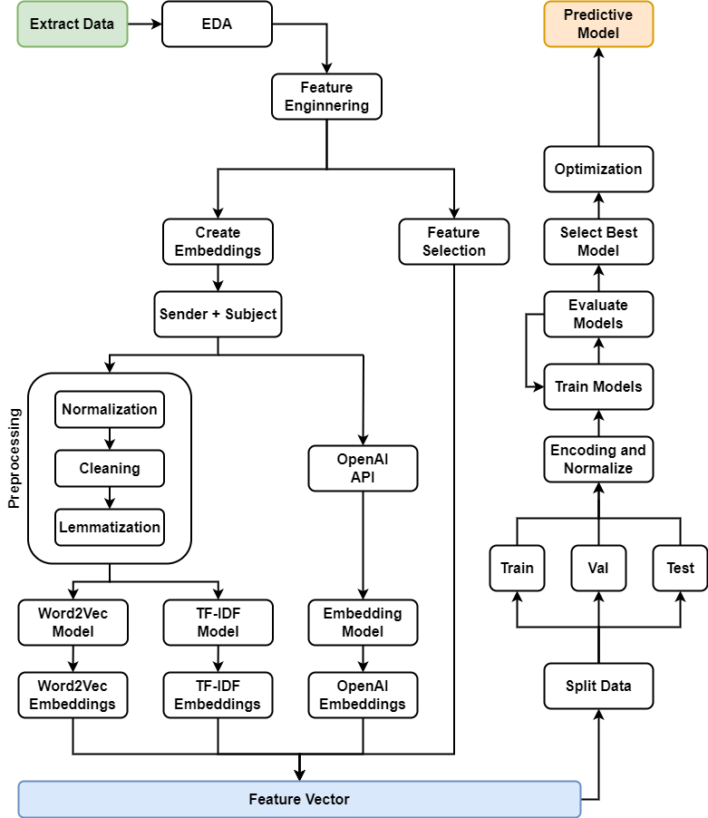
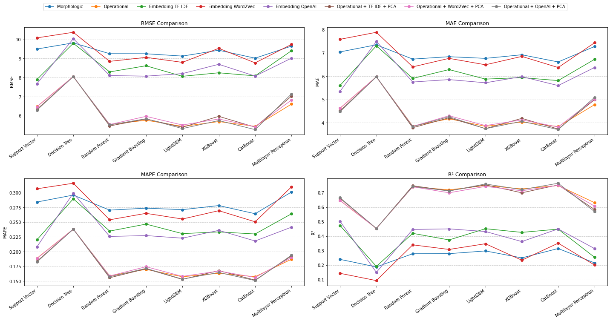
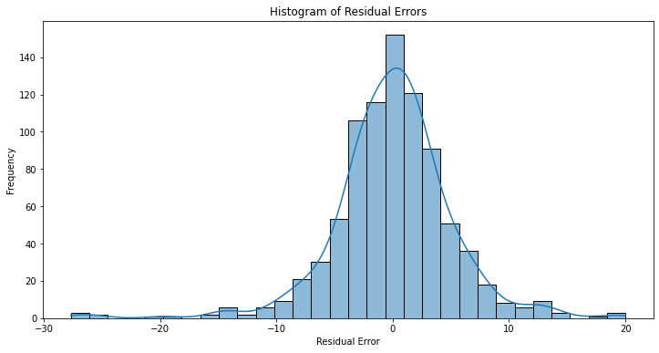
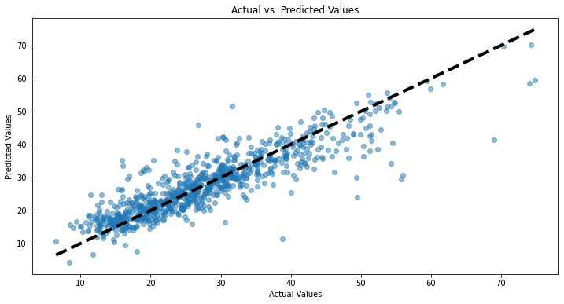
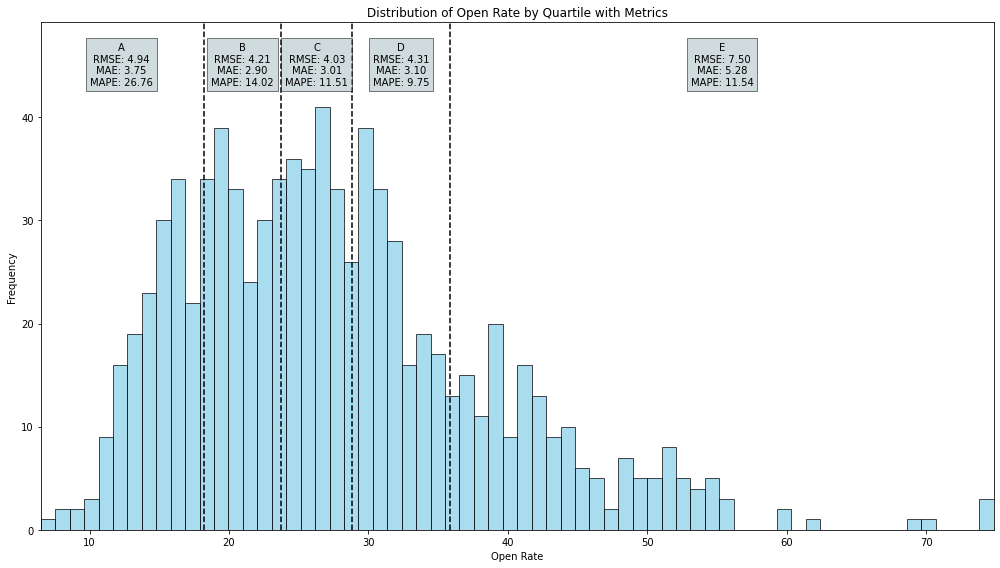

# Predicting Email Open Rates Using Text Mining and Machine Learning

## Table of Contents
1. [Introduction](#introduction)
2. [Project Structure](#project-structure)
3. [Setup and Installation](#setup-and-installation)
4. [Flowchart](#flowchart)
5. [Data Collection](#data-collection)
6. [Exploratory Data Analysis (EDA)](#exploratory-data-analysis-eda)
7. [Embedding Generation](#embedding-generation)
8. [Data Splitting](#data-splitting)
9. [Data Preprocessing](#data-preprocessing)
10. [Training and Evaluation of Models](#training-and-evaluation-of-models)
11. [Model Optimization](#model-optimization)
12. [Feature Importance Analysis](#feature-importance-analysis)
13. [Model Diagnostics](#model-diagnostics)
14. [Comparison Across Quartiles](#comparison-across-quartiles)
15. [Conclusion and Future Work](#conclusion-and-future-work)

## Introduction

This project focuses on predicting email open rates based on subject lines using advanced text mining and machine learning techniques. The study involves extracting textual features from email subject lines and combining them with business operational variables to develop predictive models. The goal is to identify the best-performing model and feature set to enhance the effectiveness of email marketing campaigns.

## Project Structure

The project is structured as follows:

- data/
- images/
- models/
- 01-collect-data.ipynb
- 02-eda-preprocessing.ipynb
- 03-create-embeddings.ipynb
- 04-split-data.ipynb
- 05-compare-embeddings.ipynb
- 06-optimization-results.ipynb
- keys.env
- keys.json
- .gitignore
- README.md

## Setup and Installation

1. Clone the repository:
   ```sh
   git clone <repository-url>
   cd <repository-directory>

2. Install the required packages:
    ```sh
   pip install -r requirements.txt

## Flowchart
Architecture of all process.



## Data Collection

The dataset is sourced from extensive email campaigns executed by Plusdin. The data includes attributes such as sender details, subject lines, delivery statistics, and user engagement metrics. The data is collected using secure queries from a comprehensive email marketing database.

- Notebook: 01-collect-data.ipynb

## Exploratory Data Analysis (EDA)

EDA involves cleaning the data to ensure accuracy, handling missing values, and filtering based on delivery thresholds. Feature engineering is conducted to create new variables that provide more granular insights.

- Notebook: 02-eda-preprocessing.ipynb

## Embedding Generation

Three types of embeddings are generated to capture semantic information from email subject lines:

1. TF-IDF Embeddings
2. Word2Vec Embeddings
3. OpenAI Embeddings

These embeddings help in representing textual nuances that contribute to accurate open rate predictions.

- Notebook: 03-create-embeddings.ipynb

## Data Splitting

The dataset is split into training, validation, and test sets to ensure robust model training and evaluation.

- Notebook: 04-split-data.ipynb

## Data Preprocessing

Data preprocessing includes encoding categorical variables using One-Hot Encoding, normalizing numerical features using Min-Max Scaling, and reducing the dimensionality of embeddings using Principal Component Analysis (PCA).

## Training and Evaluation of Models

Several regression models are trained and evaluated using key metrics such as RMSE, MAE, R², and MAPE. The models tested include Decision Trees, Ensemble Methods, Linear Methods, and Neural Networks.

- Notebook: 05-compare-embeddings.ipynb



## Model Optimization

Hyperparameters of the best-performing model are optimized using Grid Search to further enhance its performance.

- Notebook: 06-optimization-results.ipynb

## Feature Importance Analysis

Feature importance analysis is conducted using the optimized model to identify the most influential features in predicting email open rates.

## Model Diagnostics

Diagnostic analysis includes visualizations such as the histogram of residual errors:



And actual vs. predicted values:



## Comparison Across Quartiles

The model's performance is analyzed by dividing the data into quartiles based on open rates. This helps understand the model's performance across different segments and identify areas for improvement.

